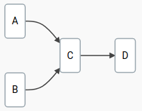
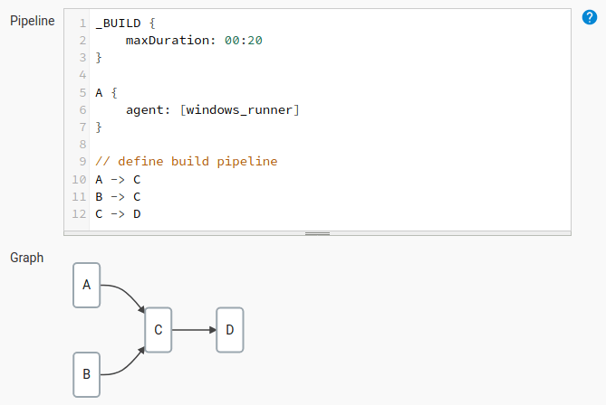

    

## Introduction

DepBuilder is a Jenkins plugin for building project dependencies in a specific
order. The main idea is to improve the experience of defining the Jenkins build
pipelines that consist of existing jobs and plugins, speeding up your build
via automatic job parallelization and making the build process glancable
via live build visualization. 

**Example:**

Imagine having 4 jobs (A, B, C, D) that you would like to build in a certain 
order. The build itself shouldn't take more than 20 minutes and the job A
should be built on a Windows machine called "windows_runner".

    

With the DepBuilder plugin the process of defining such pipeline would be:

1. Create a new project
2. Define the pipeline dependencies
3. Run the build 

### 1. Create a new project

Create a new Jenkins project, pick your pipeline name and select the DepBuilder project

    

### 2. Define the build dependencies

Define the build pipeline out of existing Jenkins jobs via a strict domain specific
language that is checking for typos, missing build agents, cyclic dependencies and 
other problems as you type. The build pipeline graph below the script input box 
is automatically updated based on the pipeline definition in your script.

    

### 3. Run the build

Run the build and watch the progress or review past builds. The colors of the nodes in
the graph represent the build status:

* **Blue**: success
* **Red**: error
* **Yellow**: aborted
* **White**: not built
* **Fading blue**: in progress

    

## Documentation

DepBuilder documentation is located [here](https://docs.royalsloth.eu/depbuilder/latest/docs/000_intro.html).

## Installation 

For the installation instructions, check out the [Installation](https://docs.royalsloth.eu/depbuilder/latest/docs/004_installation.html) page.

## Pro

[DepBuilder Pro](https://www.royalsloth.eu/products/depbuilder/) is an extension of DepBuilder Community 
plugin that contains additional features (such as automatic parallel build of dependencies in the pipeline) 
and priority email support from the DepBuilder creators in case of any unforeseen
issues.

For a full list of features, see the [Features](https://docs.royalsloth.eu/depbuilder/latest/docs/001_features.html) page.

## License

DepBuilder Community version is open source, released under the AGPL-3.0 license.
See [License](LICENSE) for licensing details.

## Changelog

The DepBuilder's changelog is located 
[here](https://docs.royalsloth.eu/depbuilder/latest/docs/007_changelog.html).
