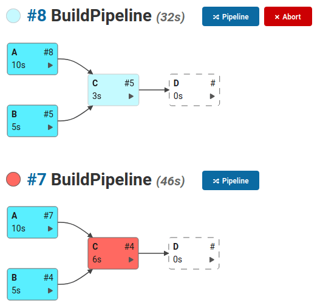

.. include:: subs.rst

Introduction
==============

Quick Introduction
----------------------

|Product| is a Jenkins plugin that simplifies the process of building project dependencies
that usually form a larger product. These project dependencies has to be built in a
specific order and declaring the build pipeline with the existing Jenkins plugins is
often a tedious process.

The main idea behind the project is not to replace the currently available plugins (e.g. Jenkins Pipeline),
but to improve the experience of defining the build pipeline that consists of **existing** jobs
and plugins, speeding up your build via automatic job parallelization and making the build process
glancable through the live build visualization.

**Example:**
Say we have 4 jobs (A, B, C, D) which we would like to build in a specific order.
The build itself shouldn't take more than 20 minutes and the job A should be built on the
Windows machine called "windows_runner".

.. image:: images/initialBuildDefinition_min.png
   :align: center
   :alt: Initial definition of the build. Jobs A, B should be built before C and job C
         should be built before D.

With the |Product| plugin the process of defining such pipeline would be:

#. Create a new project
#. Define the pipeline dependencies
#. Run the build

**1. Create a new project**
~~~~~~~~~~~~~~~~~~~~~~~~~~~~~~~~~

Create a new Jenkins project, pick your pipeline name and select the DepBuilder project.

.. image:: images/ui/newProject_min.png
   :align: center
   :alt: Create a new DepBuilder project

|

**2. Define the pipeline dependencies**
~~~~~~~~~~~~~~~~~~~~~~~~~~~~~~~~~~~~~~~~~~~~~~~~~

Create the build pipeline out of existing Jenkins jobs via a strict domain specific
language that is checking for typos, missing build agents, dependency cycles and
other problems as you type.

.. image:: images/intro/pipelineDefinition_min.png
   :align: center
   :alt: Definition of the DepBuilder build pipeline in the Jenkins user interface

|

3. Run the build
~~~~~~~~~~~~~~~~~~~~~~~~~~~~~~~~~~
Run the build and watch the pipeline progress. The nodes' colors represent the
build status of the specific project in the pipeline:

* **Blue**: success
* **Red**: error
* **Yellow**: aborted
* **White**: not built
* **Fading blue**: in progress

|

The build graph is packed with information:

.. image:: images/annotatedBuild_min.png
   :align: center
   :alt: Annotated build graph

|
|

Project Philosophy
-------------------------------

Although the currently available Jenkins pipeline plugins on the market
are quite flexible and they allow you to come up with a reasonably
complex build pipeline, their scripts are usually very fragile
and often fail late into the build process due to a typo in the script.

To avoid the mentioned problem the |Product| follows the
`Fail Fast <https://en.wikipedia.org/wiki/Fail-fast>`_ philosophy.
The pipeline script is checked for typos, missing build agents, non existing
job dependencies, cycles in the build pipeline and other preventable problems
before the build is even allowed to start.

When modifying the pipeline scripts directly in the Jenkins user interface,
the scripts are validated as you type, which allows you to refactor
the existing scripts without the fear of breaking the build and
only hearing about it on the first nightly build.

Case Study
---------------------------------------

At this point you may want to ask yourself: "Why would I trade the flexibility
of the current approach over a less flexible but fancier looking build process?"
To answer this question we should take a look at the more complicated example,
that often occurs when it comes to building the continuous integration process
of a large product.

**Example**: Imagine we are developing a software product that consists of
many different services. In the beginning such build pipeline would look quite
straight forward:

.. image:: images/intro/simpleBuild_min.png
   :align: center
   :alt: Initial build pipeline

.. code-block:: cpp

   _BUILD {
        maxDuration: 2:00
   }

   Middleware {
        maxDuration: 1:00
   }

   Server {
        agent: [linux_runner_1, linux_runner_2]
   }

   // each of the specified is a separate Jenkins FreeStyle or Pipeline job
   Middleware -> Server -> "Integration Tests" -> Deploy

Our product is getting popular and the customers would prefer to have a
local desktop application over the current web one. Since the new desktop
application has to communicate with the server, its dependency is also the Middleware
library and our build pipeline now looks like:

We simply create a new Jenkins project that is building the desktop application
and update the pipeline accordingly:

.. code-block:: cpp

    // Adding settings specific for the new project
    DesktopApp {
        agent: [windows_runner]
    }

   // Existing pipeline
   Middleware -> Server -> "Integration Tests" -> Deploy

   // Addition to the existing pipeline
   Middleware -> DesktopApp -> "Integration Tests"

.. note:: When using |Product| Pro version, the builds that could run in parallel
   (Server and DesktopApp) will automatically run in parallel with
   no additional work on your side. See :doc:`001_features` page for more info
   about the build parallelization.

The desktop application is getting popular and we would like to
restrict certain features from the free tier users, so we introduce another
custom library that is handling everything related to licensing.
Since we would prefer to share the licensing codebase between the client
and the server, we have to build the library before either of the mentioned
projects.

The current build pipeline is getting messier, but the |Product|'s
pipeline visualization helps a lot:

To include the Licensing project in the build pipeline, we only have to append
the following two lines in the |Product|'s pipeline script:

.. code-block:: cpp

    Licensing -> DesktopApp
    Licensing -> Server

The business is expanding and the native mobile application is in a great demand.

Adding another project to the pipeline is a breeze:

.. code-block:: cpp

    Licensing -> MobileApp -> "Integration Tests"
    Middleware -> MobileApp -> "Integration Tests"

The build below shows the |Product| Pro version in action that is building the
DesktopApp, MobileApp and the Server job in parallel (in this example
the Server job has already finished building). Integration tests will run only after
its dependencies (DesktopApp, Server, MobileApp) were successfully built.

.. note:: Slowly fading blue blocks represent the builds that are currently being built.
   For more info about the build visualization colors, see also the :ref:`build-visualization`
   section.
