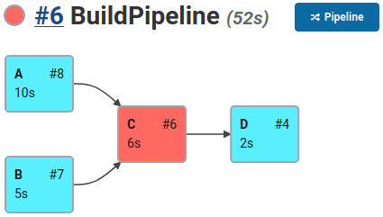

.. include:: subs.rst

User Interface
==============================

This section will guide you through the |Product|'s user interface. The process of defining
a new build pipeline is:

#. Create a new |Product| job, see :ref:`create-project` section.

#. Define the build pipeline via the |Product| DSL, see :ref:`build-definition` section.

#. Watch the build progress via the project dashboard, see :ref:`build-visualization` section.

.. _create-project:

Create the Project
----------------------------

#. On the Jenkins dashboard click on the :guilabel:`New Item` option in the left sidebar

#. Enter the build pipeline name.

#. Select the DepBuilder from the installed Jenkins plugins listed below.

#. Click OK, to create a new build pipeline using the DepBuilder DSL.

.. image:: images/ui/newProject_min.png
   :align: center
   :alt: Create a new DepBuilder project

|

.. _build-definition:

Build Definition
----------------------------

The |Product| supports two ways of defining the build pipeline:

* **Script:** write the DSL through the Jenkins user interface.

* **SCM:** fetch the DSL script via your favorite source control tool (Git, SVN, etc...).

.. _ui-script:

Script
~~~~~~~~~~~~~~~~~~~~~~~~~~~

Script configuration option is the easiest one to get started: select the script option
from the definition combobox and start defining the build pipeline in the text area below. The build
script will be verified every time the input area loses focus (click outside
of the text area). For more info about the |Product| DSL, see :doc:`001_features` page.

In case of any error made in the script, a helpful error message will show up underneath the text area.
The build visualization graph under the text area will automatically update the
build nodes according to the defined pipeline.
Clicking on the job nodes in the build visualization graph
will redirect you directly to the clicked job's dashboard.

.. image:: images/ui/pipelineConfig_min.png
   :align: center
   :alt: The Script option in the combobox pipeline definition allows you to define the
         build workflow directly in the Jenkins user interface.

.. note::

   Once you are comfortable with the |Product| DSL, we suggest you to put your pipeline
   script into the SCM repository. For more info, see the :ref:`ui-scm` option below.

.. _ui-scm:

SCM
~~~~~~~~~~~~~~~~~~~~~~~~~~~

You can also set up the build pipeline via the source control management option (SCM).
The SCM functionality is provided via the existing Jenkins plugins that you have to
install manually and are not part of the |Product|,
such as `Jenkins GIT <https://plugins.jenkins.io/git/>`_ and
`Jenkins SVN <https://plugins.jenkins.io/subversion/>`_.

#. Select the SCM from the definition dropdown.

#. Select the SCM option that you are using and enter a valid credentials.

#. Add a relative path in :guilabel:`Pipeline File Location` input field that is
   pointing to the build script in the repository.

         to download the DepBuilder build pipeline script via your favorite source
         control management tool.

After starting the build, the build will:

 #. Download the chosen repository.
 #. Verify the script from the :guilabel:`Pipeline File Location` and terminate the build
    in case of any error.
 #. If the script is valid, it will start to build the jobs defined in the script.

|

.. _build-visualization:

Build Visualization
----------------------------

While the pipeline build is in progress, you can observe the current build status of jobs
on the project's dashboard page. The following sections will describe the possible states
that your build graph might show.

.. image:: images/annotatedBuild_min.png
   :align: center
   :alt: Annotated build graph, showing explanations of the build graph sections.

|

.. note:: In case the pipeline is too wide and does not fit to the screen you can pan
          the graph with mouse (hold left mouse button and drag).

          You can also zoom in/out the pipeline with mouse wheel and holding shift.

Build in Progress
~~~~~~~~~~~~~~~~~~~~~~

When the build is in progress, the pipeline status light and the nodes that are currently being built
are slowly fading in and out in light blue color.

Build Success
~~~~~~~~~~~~~~~~~~~~~~

On a successful build, the pipeline status light and the jobs that were built successfully will be shown
in blue.

.. image:: images/buildSuccess_min.png
   :align: center
   :alt: Build graph of the aborted build.

Build Aborted
~~~~~~~~~~~~~~~~~~~~~~

When the user manually aborts the build, the aborted jobs are shown in yellow. It's possible that
the user aborted the build while there was no other job that was being built; in such case the pipeline
status light will be shown in yellow, but no other node in the graph will be marked as aborted.

Build Failed
~~~~~~~~~~~~~~~~~

When the build has failed, the pipeline status light and the job that failed will be shown in red.

If the ``onParentFailure`` option in the job settings sectoin was set to ``BUILD``, the build graph will
show the failed jobs in red, but the rest of the build will continue building. In the example
below the ``onParentFailure`` option of the job D was set to ``BUILD``.

Missing Build History
~~~~~~~~~~~~~~~~~~~~~~~~

The build history of the job could be missing either due to manual deletion or due to the
Jenkins ``Discard old builds`` build option that is set on the job's configuration page.
If the build information is missing, the graph will display such a build
job in white without the build number and duration.

.. image:: images/buildHistoryDeleted_min.png
   :align: center
   :alt: Build graph of the build that is missing build history.
