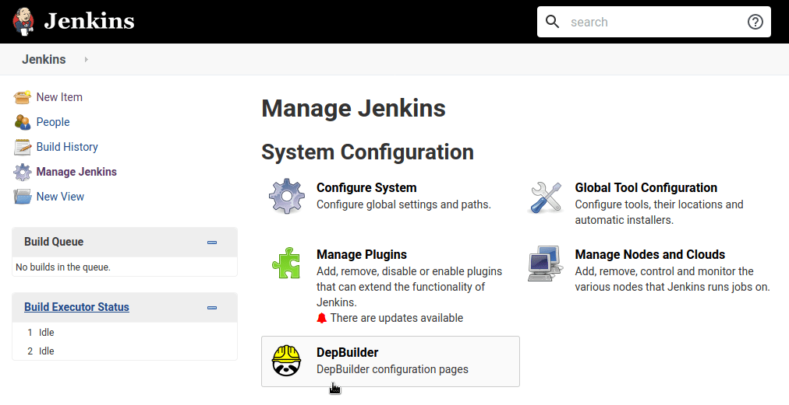
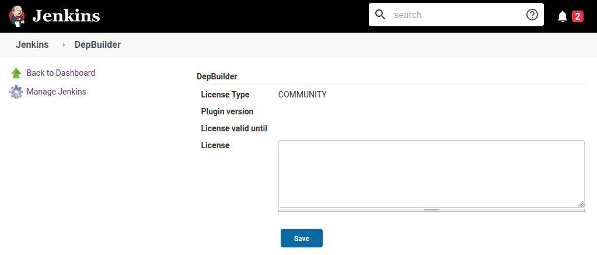

.. include:: subs.rst

Installation
===============

|Product| was developed for the Jenkins |MinSupportedJenkinsVersion| and should be working
up to the latest Jenkins version (|LatestJenkinsVersion|).

It is possible that the |Product| works even on the earlier versions (pre |MinSupportedJenkinsVersion|),
but they are not officially supported.

Community Edition
--------------------

|Product| Community version could be installed through the Jenkins plugin market place:

1. Open the Jenkins dashboard and select :guilabel:`Manage Jenkins` option in the
   sidebar on the left.

2. Click on the :guilabel:`Manage Plugins` in the System Configuration section.

3. Select the :guilabel:`Available` tab and search for the ``DepBuilder``.

4. Check the installation checkbox and click on one of the install buttons
   at the bottom of the page.

5. Restart the Jenkins master node in order to reload the installed/updated plugins

Alternatively, you could deploy the .hpi plugin file manually, as described in
the :ref:`Installation-Manual` section.

.. note:: For more info on managing Jenkins plugins, make sure to check out the official
   `Jenkins documentation <https://www.jenkins.io/doc/book/managing/plugins/>`_.

Pro Edition
--------------------

After buying the |Product| Pro version you will receive an email with the link to
the download page that contains the |Product| plugin, called ``DepBuilder-xx.hpi``
where ``xx`` represents the version number of the plugin.

The Pro version has to be installed manually, by uploading the downloaded plugin file
via the Jenkins UI as shown in the :ref:`Installation-Manual` and
:ref:`Entering-License` sections.

.. _Installation-Manual:

Manual Installation
~~~~~~~~~~~~~~~~~~~~~~~~~~~~

1. Open up a Jenkins dashboard and select :guilabel:`Manage Jenkins` option in the
   left sidebar.

2. Click on the :guilabel:`Manage Plugins` in the System Configuration section as shown on the image below:

3. Click on the :guilabel:`Advanced` tab and select the :guilabel:`Browse` button in the ``Upload Plugin``
   section. A file upload dialog will open and you should select the previously
   downloaded ``DepBuilder-xx.hpi`` file.

4. Click on the Upload button below the form to upload the selected plugin file.

5. Restart the Jenkins master node on which the plugin was installed.

.. _Entering-License:

Entering the License
~~~~~~~~~~~~~~~~~~~~~~~~~~

:guilabel:`Pro` After installing the |Product| Pro as described in the :ref:`Installation-Manual`,
you have to enter the license which you have received via email after purchasing the |Product| Pro.

Clicking on the DepBuilder configuration section should open the following form:

Enter your license and click on the save button. Saving the license should update the
following fields:

* License type
* Plugin version
* License valid until

.. note:: If your license has expired your builds are still going to work, but
   with a Community set of features. For the current difference between the two,
   see the :doc:`001_features` page.
