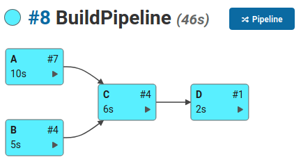

.. include:: docs/subs.rst

DepBuilder Documentation
======================================

DepBuilder is a Jenkins plugin used for building complex projects
with a lot of dependencies that should be built in the specific order.

**Example:**
Say we have 4 jobs (A, B, C, D) which we would like to build in a specific order.
The build itself shouldn’t take more than 20 minutes and the job C should be
built on a Windows machine.

.. image:: docs/images/initialBuildDefinition_min.png
   :align: center
   :alt: Initial definition of the build order. Jobs A, B should be built before C and job C
         should be built before job D.

With the |Product| plugin we could define such build pipeline with the following script:

.. code-block:: cpp

    _BUILD {
        maxDuration: 00:20
    }

    C {
        agent: [windows_runner]
    }

    A -> C
    B -> C
    C -> D

After building the pipeline, you should be able to see a similar build graph to the one below:

|

For more information about the |Product|, see also the rest of the documentation starting
with :doc:`docs/000_intro` page.

Documentation
--------------------
If you are looking for a documentation of a different |Product| version, please check
the |DocumentationAll| page.

Product Page
--------------------

See |ProductPage|

|

.. toctree::
   :maxdepth: 2
   :caption: Table of Contents

   docs/000_intro.rst
   docs/001_features.rst
   docs/002_ui-overview.rst
   docs/004_installation.rst
   docs/005_faq.rst
   docs/007_changelog.rst
   docs/006_support.rst

..  docs/007_changelog.rst

.. Indices and tables
.. ==================
..
.. * :ref:`genindex`
.. * :ref:`modindex`
.. * :ref:`search`
